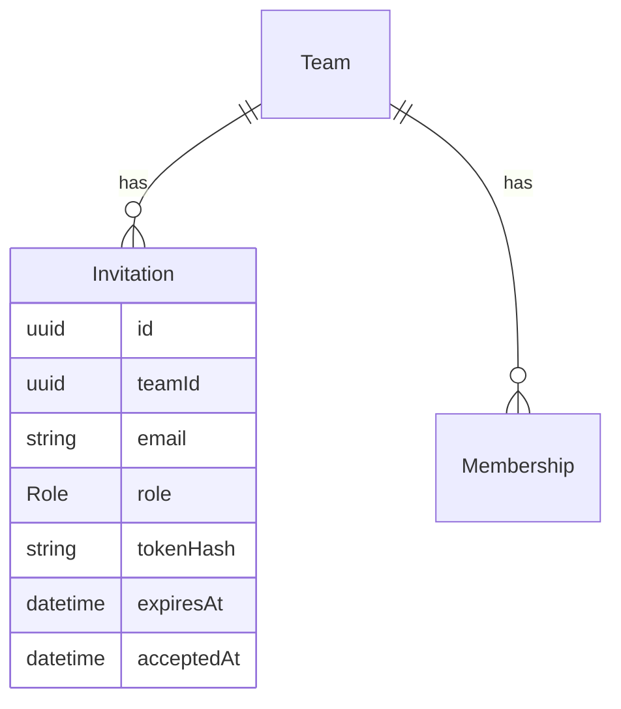
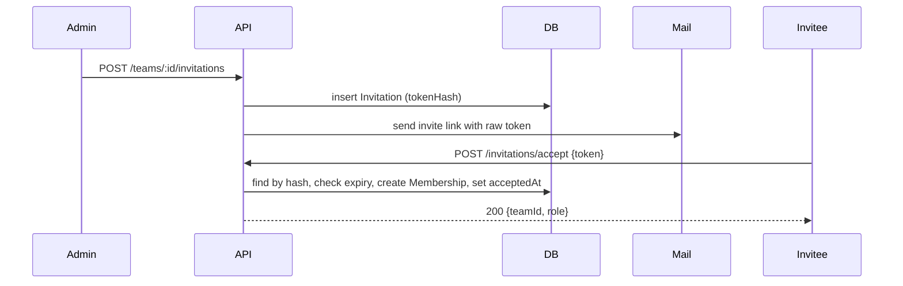

# Blueprint template

Every blueprint follows this structure. The example is a team-invitations feature; replace it with the real content. Keep the headings exactly as written, because `/blueprint-build` and `/blueprint-clean` read them.

The blueprint is read by an agent that has never seen the planning conversation. Write every section so it stands on its own: name real files, spell out rules, and never write "as discussed".

````markdown
---
title: Team invitations
slug: team-invitations
status: draft
created: 2026-09-28
base_branch: main
---

# Team invitations

## Goal

Team admins can invite people by email. The invitee gets a link, accepts it,
and joins the team with the role the admin picked.

## Non-goals

- Bulk invites from CSV.
- Invites to people who already have an account in another org.

## Context

- `src/teams/team.ts`: the `Team` and `Membership` models. Memberships already carry a `role`.
- `src/api/routes/teams.ts`: team routes. Auth is `requireRole("admin")` middleware.
- `src/mail/send.ts`: `sendMail(template, to, vars)`. Templates live in `src/mail/templates/`.
- Tests: Vitest, `*.test.ts` next to the source, database tests use `withTestDb()`.

## Domain models



**Invitation** (new)
- `email` is stored lowercased and trimmed.
- `tokenHash` is a SHA-256 of the token; the raw token only exists in the email.
- `expiresAt` is 7 days after creation.

Invariants:
- At most one pending (not accepted, not expired) invitation per `(teamId, email)`.
- An accepted invitation is never accepted again.

## APIs

**`POST /teams/:teamId/invitations`** (admin only)
- Body: `{ email: string, role: "member" | "admin" }`
- 201: `{ id, email, role, expiresAt }`
- 409 `already_member`: the email already belongs to a team member.
- 409 `already_invited`: a pending invitation exists. Resend instead.

**`POST /invitations/accept`** (signed in)
- Body: `{ token: string }`
- 200: `{ teamId, role }`
- 410 `expired`, 404 `not_found`, 409 `already_accepted`

## Data flow



1. The admin creates the invitation. The API hashes a random token, stores the hash and emails the raw token.
2. The invitee opens the link and, once signed in, posts the token.
3. Accepting creates the membership and sets `acceptedAt` in one transaction.

## Logic to test

**Creating an invitation** (`src/teams/invitations.test.ts`)
- normalizes `"  Bob@Example.com "` to `"bob@example.com"`
- rejects a second pending invite for the same email with `already_invited`
- allows a new invite once the previous one has expired
- rejects an email that already belongs to a member with `already_member`

**Accepting an invitation**
- creates a membership with the invited role
- returns `expired` one second after `expiresAt` (inject the clock)
- returns `already_accepted` on the second accept and creates no second membership
- rolls back the membership if setting `acceptedAt` fails

## Implementation steps

- [ ] 1. Add the `Invitation` model and migration. Verify: migration runs up and down.
- [ ] 2. Add `createInvitation` in `src/teams/invitations.ts` with its tests.
- [ ] 3. Add `acceptInvitation` with its tests.
- [ ] 4. Add the invite email template and send it from `createInvitation`.
- [ ] 5. Add both routes in `src/api/routes/`. Verify: route tests for each status code.

## Decisions

- **Store a token hash, not the token.** A database leak shouldn't expose working invite links. Alternative: store the raw token (simpler lookups).
- **Unique pending invite per email.** Stops duplicate emails. Alternative: allow many and accept any (confusing when roles differ).

## Open questions

None.
````

`/blueprint-build` adds these at the end:

```markdown
## Deviations

- Step 3: <what changed from the plan and why>

## Summary

<the build summary>
```

## Status values

- `draft`: still being planned. `/blueprint-build` refuses it.
- `approved`: the user approved it and there are no open questions.
- `building`: `/blueprint-build` has started. The checkboxes show progress.
- `done`: built and summarized. `/blueprint-clean` removes it.

## Diagram guidance

- **Domain models:** `erDiagram`. Show only the entities this feature adds or changes and the ones they relate to.
- **Data flow:** `sequenceDiagram` for requests that pass between components; `flowchart` for branching logic or background jobs.
- Keep each diagram under about 15 nodes. Split it rather than cram it.
- Every diagram gets a short numbered walkthrough in prose, so the section still makes sense where Mermaid doesn't render.
